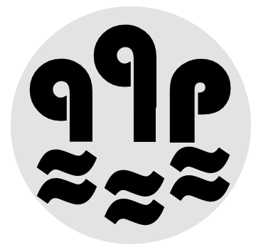

## Centre for Big Data Engineering & Analytics, IIIT Bangalore

This research center at [International Institute of Information Technology Bangalore](https://www.iiitb.ac.in/) (IIITB) focuses on various aspects of Information Management including developing scalable Big Data processing architectures, and building systems and methods to manage and process structured, semi-structured, and unstructured high-velocity data from diverse sources for distributed data analytics. The “Big” refers to not just the volume of data, but also challenges concerning the variety, veracity, and velocity of the data. 

This center was originally established in 2019 with Prof. Srinath Srinivasa as the founding member to enable collaboration between IIIT Bangalore, with [City University London](https://www.city.ac.uk/), as the UK partner, and Siemens Research, India, as the industry partner. Currently, in addition to the Royal engineering FCRA grant, the center is supported by several other grants and funding. Earlier projects carried out in this center can be found on the [WSL website](http://wsl.iiitb.ac.in/co-creation-of-a-center-of-excellence-in-big-data-engineering/).

test line

### Projects
<tr>
  <table>
  <tr>
    <td></td>
    <td>Data-Lake</td>
    <td>Funded by Gov. of Karnataka. Prof. Srinath Srinvasa and Prof. Sridhar Mandyam are the other leads.</td>
  </tr>
  <tr>
      <td></td>
    <td>ReasonAIR </td>
    <td>In collaboration with Dr. Raghava Mutharaju (https://www.iiitd.ac.in/raghavam), IIIT Delhi </td>
  </tr>
  <tr>
    <td></td>
    <td>Data Anonimizer</td>
    <td>Funded by CIET, IIITB. In collaboration with Prof. Chandrashekar Ramanathan, IIITB </td>
  </tr>
  <tr>
       <td></td>
    <td>AIR</td>
    <td>Funded completely by the University of Luxembourg. </td>
  </tr>
  <tr>
       <td></td>
    <td>TensAIR</td>
    <td>In collaboration with the University of Luxembourg. Mauro Dalle Lucca Tossi and Prof. Martin Theobald are the collaborators. </td>
  </tr>
</table>

